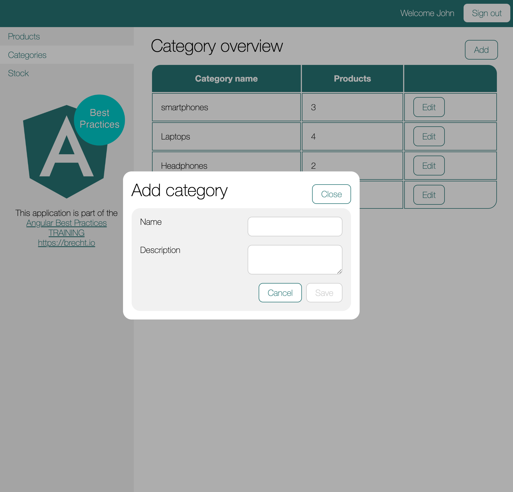

To start with this class we need to take package `002` from the course files.


Start the `stock-manager` application by running :

```shell
npx nx run stock-manager:serve

```
Start the mock api by running:
```shell
npm run api
```

## Refactoring AddCategorySmartComponent to use child routes

The first thing we need to do is change our routing.
We want to render the following component in a dialog:
- `AddCategorySmartComponent`

To achieve this we need to render it as a child from `CategoryOverviewSmartComponent`.

In `libs/stock-manager-feat-stock/src/lib/lib.routes.ts` we have to update the configuration accordingly:

```typescript
// libs/stock-manager/feat-stock/src/lib/lib.routes.ts
export const stockManagerFeatStockRoutes: Route[] = [
    ...
    {
        path: 'categories',
        component: CategoryOverviewSmartComponent,
        children: [
            {
                path: 'add', // don't forget to remove the catories in the path
                component: AddCategorySmartComponent,
            }
        ]
    },
    {
        path: 'categories/:categoryId',
        path: 'categories/:categoryId',
        component: EditCategorySmartComponent,
    },
    ...
];
```

The next thing we need to do is add a **router-outlet** to the `CategoryOverviewSmartComponent`:

```html
<!--libs/stock-manager/feat-stock/src/lib/smart-components/category-overview/category-overview.smart-component.html-->
<div class="category-overview__top">
    ...
</div>
<div class="category--overview__content">
   ...
</div>
<router-outlet></router-outlet>
```

This means we have to add the `RouterModule` to the import property of the `CategoryOverviewSmartComponent`.

```typescript
@Component({
  selector: 'sh-category-overview',
  ...
  imports: [
    ...
    RouterModule,
  ],
})
```

That's it for the routing part, this when navigating to [http://localhost:4200/categories/add](http://localhost:4200/categories/add) it should show the Add category view on the bottom
of the page. 

## Creating the dialog component

First of all we will create a reusable ui component in `frontend-ui-design-system` by running:

```shell
npx nx g @nrwl/angular:component ui-components/dialog --project=frontend-ui-design-system --type=ui-component
```

We will use 2 slots to project our content called `sh-dialog-header` and `sh-dialog-body`.
We can update the html accordingly:

```html
<!--libs/frontend/ui-design-system/src/lib/ui-components/dialog/dialog.ui-component.html-->
<div class="dialog">
  <div class="dialog__header">
    <ng-content select="[sh-dialog-header]"></ng-content>
  </div>
  <div class="dialog__body">
    <ng-content select="[sh-dialog-body]"></ng-content>
  </div>
</div>
```

Let's add some css in `libs/frontend/ui-design-system/src/lib/ui-components/dialog/dialog.ui-component.scss`:

```scss
@import 'variables';

.dialog {
  display: flex;
  flex-direction: column;
  border-radius: $shoppie--gridunit*2;
  padding: $shoppie--gridunit*2;
  background: #fff;

  &__header {
    display: flex;
    align-items: center;
    justify-content: space-between;
  }
}
```

Let's make the component available by updating barrel file of its lib `libs/frontend/ui-design-system/src/index.ts`:

```typescript
...
export * from './lib/ui-components/dialog/dialog.ui-component';
```

Add the `DialogUiComponent` to the imports in:
- `libs/stock-manager/feat-stock/src/lib/smart-components/add-category/add-category.smart-component.ts`

```typescript
import {
    ...
    DialogUiComponent,
} from '@shoppie/frontend/ui-design-system';
...

@Component({
  ...
  imports: [
    ...
    DialogUiComponent
  ],
})
```

Update the templates of the `AddCategorySmartComponent` so it uses our new `DialogUiComponent`:

```html
<!--libs/stock-manager/feat-stock/src/lib/smart-components/add-category/add-category.smart-component.html-->
<sh-dialog>
  <ng-container sh-dialog-header>
    <h1>Add category</h1>
  </ng-container>
  <ng-container sh-dialog-body>
    <div class="add-category">
      <sh-pane>
        <form (ngSubmit)="onSubmit()" #form="ngForm">
          <label>
            <span>Name</span>
            <input [(ngModel)]="category.name" name="name" required/>
          </label>
          <label>
            <span>Description</span>
            <textarea
              [(ngModel)]="category.description"
              name="description"
              required
            ></textarea>
          </label>

          <div class="add-category__actions">
            <a shButton routerLink="../">Cancel</a>
            <button shButton [disabled]="form.invalid">Save</button>
          </div>
        </form>
      </sh-pane>
    </div>
  </ng-container>
</sh-dialog>
```

## Using the CDK to create dialog functionality

Next we need to install the @angular/cdk package by running:

```shell
npm i @angular/cdk@15.1.0 --save
```
We will use the overlay that needs some CDK prebuilt styles to render, e.g: the backdrop. 
In `apps/stock-manager/src/styles.scss` we can import that by adding:

```css
@import '@angular/cdk/overlay-prebuilt.css';
```

We need the portal and overlay so let’s import the `PortalModule` and the `OverlayModule` into our `DialogUiComponent`.
Let's also add the `ButtonUiComponent` in there. We will need it for the close button.
```typescript
...
import { ButtonUiComponent } from '../button/button.ui-component';
import { OverlayModule } from '@angular/cdk/overlay';
import { PortalModule } from '@angular/cdk/portal';
@Component({
  selector: 'sh-dialog',
  ...
  imports: [..., OverlayModule, PortalModule, ButtonUiComponent]
})
```

In `libs/frontend/ui-design-system/src/lib/ui-components/dialog/dialog.ui-component.html`
we need to wrap our component in an `ng-template` that uses the `cdkPortal` directive.
We also need to add a close button that will emit on a `closeDialog` output we will have to create:

```html
<ng-template cdkPortal>
  <div class="dialog">
    <div class="dialog__header">
      <ng-content select="[sh-dialog-header]"></ng-content>
      <button shButton (click)="closeDialog.emit()">Close</button>
    </div>
    <div class="dialog__body">
      <ng-content select="[sh-dialog-body]"></ng-content>
    </div>
  </div>
</ng-template>
```

The first thing we need to do is create an `overLayRef`. We will use the `Overlay` from the CDK
to create that `overlayRef` by using its `create()` function. It takes an `overlayConfig` parameter to
configure its position, width, backdrop, etc.

```typescript
@Component({
    selector: 'sh-dialog',
    standalone: true,
    imports: [CommonModule, OverlayModule, PortalModule, ButtonUiComponent],
    templateUrl: './dialog.ui-component.html',
    styleUrls: ['./dialog.ui-component.scss'],
})
export class DialogUiComponent {
    private readonly overlay = inject(Overlay);
    private readonly overlayConfig = new OverlayConfig({
        // show backdrop
        hasBackdrop: true,
        // position the dialog in the center of the page
        positionStrategy: this.overlay.position().global().centerHorizontally().centerVertically(),
        // when in the dialog, block scrolling of the page      
        scrollStrategy: this.overlay.scrollStrategies.block(),
        minWidth: 500,
    });
    private overlayRef = this.overlay.create(this.overlayConfig);
}
```

The next thing we need to do is attach the portal to the `overlayRef` so we can leverage that portal
to render the contents of it inside the overlay. We have to do that
after the view is initialized, so we will need to handle this in the `ngAfterViewInit` lifecycle hook.
We will use `@ViewChild(CdkPortal)` to get a handle on the `portal` we have defined in our template:

```typescript
export class MyDialogComponent implements AfterViewInit {
    private readonly overlay = inject(Overlay);
    // get a grasp on the ng-template with the cdkPortal directive
    @ViewChild(CdkPortal) public readonly portal: CdkPortal | undefined;

    private readonly overlayConfig = new OverlayConfig({...});
    private overlayRef = this.overlay.create(this.overlayConfig);
    
    public ngAfterViewInit(): void {
        // Wait until the view is initialized to attach the portal to the overlay
        this.overlayRef?.attach(this.portal);
    }
}
```

This is the only thing we need to do to make this work, but we have forgotten about the destruction of this component.
The component does not have any close functionality as it's not his responsibility.
The dialog will be closed/destroyed by an `*ngIf` or a route change.
However we do need to clean up the `overlayRef` by calling its `detach()` function and its `dispose()`
function. We will do that on the `ngOnDestroy` lifecycle hook:

```typescript

export class MyDialogComponent implements AfterViewInit, OnDestroy {
    // Tell the parent to destroy the component
    @Output() public readonly closeDialog = new EventEmitter<void>();

    @ViewChild(CdkPortal) public readonly portal: CdkPortal | undefined;
    ...
    public ngOnDestroy(): void {
        // parent destroys this component, this component destroys the overlayRef
        this.overlayRef?.detach();
        this.overlayRef?.dispose();
    }
}
```

We see that we have added a `closeDialog` output that will be called from within the template
when the close button is clicked.

### Closing on backdrop click

By clicking the close button in the dialog we can tell our parent to destroy the `MyDialog` component.
However, we want to do the same when the user clicks on the backdrop.

It turns out that our `overlayRef` has a function called `backdropClick()` that will return an observable receiving
events when the user clicks on the backdrop. We could leverage that to close the dialog by emitting on the `closeDialog`
EventEmitter. In our constructor we can subscribe to that observable and emit when needed:

```typescript
constructor() {
    this.overlayRef?.backdropClick()
        .subscribe(() => {
            this.closeDialog.emit();
        });
}
```

When we now navigate to [http://localhost:4200/categories/add](http://localhost:4200/categories/add) we should be able 
to see a nice dialog but it's not closing yet. The dialog itself is only responsible for the destruction of the 
`overlayRef`. It's the `AddCategoryComponent` that should navigate away:
In `libs/stock-manager/feat-stock/src/lib/smart-components/add-category/add-category.smart-component.html` use the `(closeDialog)` output to call a `close` function:
```html
<sh-dialog (closeDialog)="close()">
    ...
</sh-dialog>
````

In `libs/stock-manager/feat-stock/src/lib/smart-components/add-category/add-category.smart-component.ts` add a `close` method
to destroy the dialog:

```typescript
public close(): void {
    this.router.navigate(['..'], {relativeTo: this.activatedRoute})
}
```

