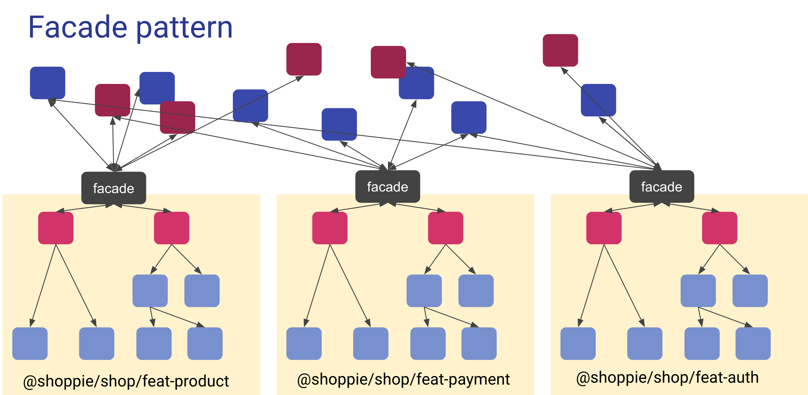

To start with this class we need to take package `001` from the course files.


# Facade pattern

To abstract our presentation layers away from the rest of the of our codebase we will introduce facades.
Every feature lib will have one facade that will act as its api towards the rest of the codebase.

A facade is only an injectable that will consume state and data-access services.

```shell
npx nx g @nrwl/angular:service facade --project=shop-feat-auth &&
npx nx g @nrwl/angular:service facade --project=shop-feat-payment &&
npx nx g @nrwl/angular:service facade --project=shop-feat-product &&
npx nx g @nrwl/angular:service facade --project=shop-feat-shell &&
npx nx g @nrwl/angular:service facade --project=stock-manager-feat-auth &&
npx nx g @nrwl/angular:service facade --project=stock-manager-feat-stock &&
npx nx g @nrwl/angular:service facade --project=stock-manager-feat-shell
```

We can inject the facade into the right smart components like this:

```typescript
import {FacadeService} from '../facade.service';
...
private readonly facadeService = inject(FacadeService);
```



An example of a facade service:
 
```typescript
export class FacadeService {
    private readonly userService= inject(UserService);
    private readonly paymentService= inject(PaymentService);
    private readonly userState= inject(UserState);
    private readonly menuState= inject(MenuState);
    
    public readonly currentUser$ = this.userState.currentUser$;
    public readonly authenticated$ = this.userState.authenticated$;
  
    public getUsers(): Observable<PagedList<User>>{
        return this.userService.getAll();
    }
    
    public purchase(purchaseDto: PurchaseDto): Observable<void>{
        return this.paymentService.purchase(purchaseDto);
    } 
    public collapseMenu(): void {
        this.menuStateService.collapse();
    }
}
```

A **BAD** example of a facade service: 

```typescript
export class FacadeService {
    private readonly userService = inject(UserService);
    private readonly userState = inject(UserState);
    private readonly menuState = inject(MenuState);
    // BAD PRACTICE: don't keep state in facades
    public readonly currentUser$ = new BehaviorSubject(null);
    public readonly authenticated$ = this.userState.authenticated$;
  
    public getUsers(): Observable<User>{
        // BAD PRACTICE: there should be no logic
        return this.userService.getAll().pipe(map(resp => resp.elements));
    }
    
    public collapseMenu(): void {
        // BAD PRACTICE: there should be no logic
        if(!this.menuState.collapsed){
            this.menuStateService.collapse();
        }       
    }
}
```
