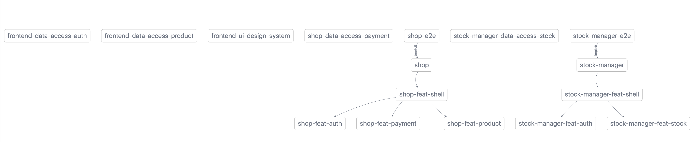

# Generating our solution

In this chapter we are going to generate all the applications, libraries, set up routing
and enfoce module boundaries

## Generating an empty workspace

The first thing we need to do is generate the workspace.
Our workspace/company/npm-scope will be called `shoppie`.
The version from this command is specified because we don't want to have any unpleasant surprises during the workshop.
This version will get updated by the latest version regularly.
We will create an nx workspace with the name `shoppie` by running this command:

```shell
npx create-nx-workspace@15.7.1 shoppie
```

We want the cleanest workspace possible so we are not selecting Angular from the selection menu, but
we will rather select the `apps` choice from the selection menu. 
Selection menu:
 - `apps`
 - Nx cloud: `yes`
 
## Installing Angular

First of all change the directory to `shoppie` by running: 

```shell
cd shoppie
``` 
and afterwards
install the `@nrwl/angular` package by running:
 
```shell
npm i @nrwl/angular@15.7.1 -D
``` 
so it gets added to the **devdependencies** of our
`package.json` file.


## Generating the apps 

To generate angular apps we will need the `@nrwl/angular:application` generator.
We can go for the wizard approach but by passing properties we can give the generator more information.
- `--tags`: Pass along the tags of the scope and type of the project
- `--prefix`: Pass the prefix that our components and directives should get
- `--routing`: Set up basic routing for standalone components
- `--standalone`: We want to create standalone components rather than Angular modules
- `--style`: Let's tell the generator to use **scss**
- `--skipTests`: We will skip tests for now, and add tests later

To generate the `shop` application you will need to run this command:

```shell
npx nx g @nrwl/angular:application shop --tags=scope:shop,type:app --prefix=sh --routing --standalone --style=scss --skipTests
``` 

We don't want to add the `--routing` `--style`, `--standalone` and `--skip-tests` every time. We can configure that in the `@nrwl/angular:application` section of
 the `generators` section of the `nx.json` config file. We also want to do this for the library (`@nrwl/angular:library`) and the
 component (`@nrwl/angular:component`).
 You can just copy paste the `generators` section in the `nx.json` file:
 
 ```json
"generators": {
    "@nrwl/angular:application": {
        "style": "scss",
        "skipTests": true,
        "standalone": true,
        "routing": true,
        "prefix": "sh",
        "linter": "eslint",
        "unitTestRunner": "jest",
        "e2eTestRunner": "cypress"
    },
    "@nrwl/angular:library": {
        "linter": "eslint",
        "style": "scss",
        "prefix": "sh",
        "skipModule": true,
        "skipTests": true,
        "standalone": true,
        "unitTestRunner": "jest"
    },
    "@nrwl/angular:component": {
        "skipTests": true,
        "standalone": true,
        "style": "scss"
    },
    "@nrwl/angular:service": {
      "skipTests": true
    }
},
```

```shell
npx nx g @nrwl/angular:application stock-manager --tags=scope:stock-manager,type:app
``` 


## Generating the shell libs/components and wire them

To generate angular libs we will need the `@nrwl/angular:lib` generator.
Let's again go for the parameter approach rather than the wizard approach.
- `--tags`: Pass along the tags of the scope and type of the project
- `--routing`: Set up basic routing for standalone components
- `--lazy`: Set up lazy loading
- `--standalone`: We want to create standalone components rather than Angular modules
- `--style`: Let's tell the generator to use **scss**
- `--skipTests`: We will skip tests for now, and add tests later


```shell
npx nx g @nrwl/angular:library shop/feat-shell --tags=scope:shop,type:feat --routing --lazy &&
npx nx g @nrwl/angular:library stock-manager/feat-shell --tags=scope:stock-manager,type:feat --routing --lazy 
```

Those commands will have generated the libs and the shell components. Now let's wire them.

Remove `apps/shop/src/app/nx-welcome.component.ts` and remove the references from `apps/shop/src/app/app.component.ts`.
Set the contents of `apps/shop/src/app/app.component.html` to:
```html
<router-outlet></router-outlet>
```

Remove `apps/stock-manager/src/app/app.component.html` and remove the references from `apps/stock-manager/src/app/app.component.ts`
Set the contents of `apps/stock-manager/src/app/app.component.html` to:
```html
<router-outlet></router-outlet>
```

The last step is to import the routing in our applications.

In `apps/shop/src/app/app.routes.ts` import the `shopFeatShellRoutes` like this:

```typescript
import { Route } from '@angular/router';
import {shopFeatShellRoutes} from '@shoppie/shop/feat-shell';

export const appRoutes: Route[] = shopFeatShellRoutes;

```

In `apps/stock-manager/src/app/app.routes.ts` import the `stockManagerFeatShellRoutes` like this:

```typescript
import { Route } from '@angular/router';
import {stockManagerFeatShellRoutes} from '@shoppie/stock-manager/feat-shell';

export const appRoutes: Route[] = stockManagerFeatShellRoutes;

```

## Generating the lazy loaded feat libs and connecting the dots

Now we want to generate the feature libs `shop/feat-product`, `shop/feat-payment`, `shop/feat-auth`, `stock-manager/feat-stock`, `stock-manager/feat-auth`.


```shell
npx nx g @nrwl/angular:library shop/feat-product --tags=scope:shop,type:feat --lazy --routing &&
npx nx g @nrwl/angular:library shop/feat-payment --tags=scope:shop,type:feat --lazy --routing &&
npx nx g @nrwl/angular:library shop/feat-auth --tags=scope:shop,type:feat --lazy --routing &&
npx nx g @nrwl/angular:library stock-manager/feat-stock --tags=scope:stock-manager,type:feat --lazy --routing &&
npx nx g @nrwl/angular:library stock-manager/feat-auth --tags=scope:stock-manager,type:feat --lazy --routing
```

## Generating the data-access libs

It's important to note that the `skipModule` property is set to true in the `generators` section of the `nx.json` file.

```shell
npx nx g @nrwl/angular:library shop/data-access-payment --tags=scope:shop,type:data-access &&
npx nx g @nrwl/angular:library frontend/data-access-auth --tags=scope:frontend,type:data-access &&
npx nx g @nrwl/angular:library frontend/data-access-product --tags=scope:frontend,type:data-access &&
npx nx g @nrwl/angular:library stock-manager/data-access-stock --tags=scope:stock-manager,type:data-access
```

## Generating the type libs

It's important to note that the `skipModule` property is set to true in the `generators` section of the `nx.json` file.

```shell
npx nx g @nrwl/angular:library shop/type-payment --tags=scope:shop,type:type &&
npx nx g @nrwl/angular:library frontend/type-auth --tags=scope:frontend,type:type &&
npx nx g @nrwl/angular:library frontend/type-product --tags=scope:frontend,type:type
```

## Generating the ui lib

```shell
npx nx g @nrwl/angular:library frontend/ui-design-system  --tags=scope:frontend,type:ui
```

## Connecting the dots

Now it's time to wire everything together!

Add `RouterModule` in the `imports` property of the `@Component` decorator of `libs/shop/feat-shell/src/lib/shop-feat-shell/shop-feat-shell.component.ts`
and replace the contents of `libs/shop/feat-shell/src/lib/shop-feat-shell/shop-feat-shell.component.html` with:

```html
<h1>Shop</h1>
<ul>
  <li><a routerLink="payment">Payment</a></li>
  <li><a routerLink="product">Product</a></li>
  <li><a routerLink="unauthorized">Unauthorized</a></li>
</ul>
<router-outlet></router-outlet>
```

Now configure the routing by settings the contents of `libs/shop/feat-shell/src/lib/lib.routes.ts` with this:
```typescript
import { Route } from '@angular/router';
import { ShopFeatShellComponent } from './shop-feat-shell/shop-feat-shell.component';

export const shopFeatShellRoutes: Route[] = [
 {
  path: '',
  component: ShopFeatShellComponent,
  children: [
   {
    path: 'payment',
    loadChildren: () =>
            import('@shoppie/shop/feat-payment').then(
                    (mod) => mod.shopFeatPaymentRoutes
            ),
   },
   {
    path: 'product',
    loadChildren: () =>
            import('@shoppie/shop/feat-product').then(
                    (mod) => mod.shopFeatProductRoutes
            ),
   },
   {
    path: 'unauthorized',
    loadChildren: () =>
            import('@shoppie/shop/feat-auth').then(
                    (mod) => mod.shopFeatAuthRoutes
            ),
   },
  ],
 },
];

```


Add `RouterModule` in the `imports` property of the `@Component` decorator of `libs/stock-manager/feat-shell/src/lib/stock-manager-feat-shell/stock-manager-feat-shell.component.ts`
and replace the contents of `libs/stock-manager/feat-shell/src/lib/stock-manager-feat-shell/stock-manager-feat-shell.component.html` with:

```html
<h1>Stock manager</h1>
<ul>
  <li><a routerLink="stock">Stock</a></li>
  <li><a routerLink="unauthorized">Unauthorized</a></li>
</ul>
<router-outlet></router-outlet>
```

Now configure the routing by settings the contents of `libs/stock-manager/feat-shell/src/lib/routes.ts` with this:

```typescript
import { Route } from '@angular/router';
import { StockManagerFeatShellComponent } from './stock-manager-feat-shell/stock-manager-feat-shell.component';

export const stockManagerFeatShellRoutes: Route[] = [
 {
  path: '',
  component: StockManagerFeatShellComponent,
  children: [
   {
    path: 'stock',
    loadChildren: () => import('@shoppie/stock-manager/feat-stock').then(mod => mod.stockManagerFeatStockRoutes)
   },
   {
    path: 'unauthorized',
    loadChildren: () => import('@shoppie/stock-manager/feat-auth').then(mod => mod.stockManagerFeatAuthRoutes)
   }
  ]
 }
];
```


## Setting up module boundaries

In `.eslintrc.json` in the root, look up `overrides.rules.@nrwl/nx/enforce-module-boundaries` and replace it with the following config:

```json
{
  "@nrwl/nx/enforce-module-boundaries": [
    "error",
    {
      "allow": [],
      "depConstraints": [
        {
          "sourceTag": "type:app",
          "onlyDependOnLibsWithTags": [
            "*"
          ]
        },
        {
          "sourceTag": "type:type",
          "onlyDependOnLibsWithTags": [
            "type:type"
          ]
        },
        {
          "sourceTag": "type:ui",
          "onlyDependOnLibsWithTags": [
            "type:ui",
            "type:util",
            "type:type"
          ]
        },
        {
          "sourceTag": "type:util",
          "onlyDependOnLibsWithTags": [
            "type:util",
            "type:type"
          ]
        },
        {
          "sourceTag": "type:feat",
          "onlyDependOnLibsWithTags": [
            "type:util",
            "type:type",
            "type:feat",
            "type:ui",
            "type:data-access"
          ]
        },
        {
          "sourceTag": "type:data-access",
          "onlyDependOnLibsWithTags": [
            "type:util",
            "type:type",
            "type:data-access"
          ]
        },
        {
          "sourceTag": "scope:shop",
          "onlyDependOnLibsWithTags": [
            "scope:shop",
            "scope:frontend"
          ]
        },
        {
          "sourceTag": "scope:stock-manager",
          "onlyDependOnLibsWithTags": [
            "scope:stock-manager",
            "scope:frontend"
          ]
        },
        {
          "sourceTag": "scope:frontend",
          "onlyDependOnLibsWithTags": [
            "scope:frontend"
          ]
        }
      ]
    }
  ]
}
```
## Visualising the codebase with a dependency graph

Run: 
```shell
npx nx graph
```
 and
 click the **Show all projects** button.


Check if the applications run correctly

```shell
npx nx run shop:serve
```

```shell
npx nx run stock-manager:serve
```
